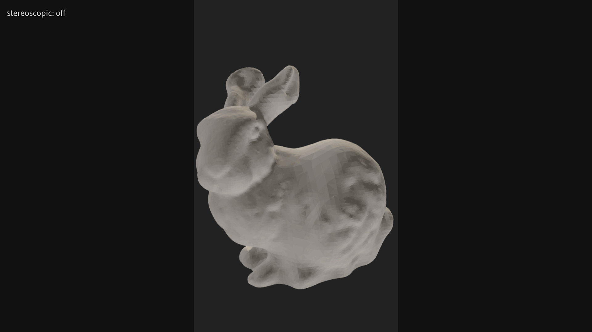

# stereoscopic

Toggle a video filter that places two copies of the video side-by-side,
creating a simple cross-eye stereoscopic illusion.



# Dependency

- mpv (compiled with FFmpeg feature enabled)

The filter uses the `lavfi` filter which is typically available if mpv was
compiled with FFmpeg support.

# Installation

```sh
make install
```

or manually copy the script:
```sh
mkdir -p ${XDG_CONFIG_HOME}/mpv/scripts
cp ./stereoscopic.lua ${XDG_CONFIG_HOME}/mpv/scripts/
```

# Keybindings

- `D` to toggle stereoscopic effect

# Configuration

To modify default Keybindings:
```conf
# $XDG_CONFIG_HOME/mpv/input.conf
D script-message toggle-stereoscopic
```
